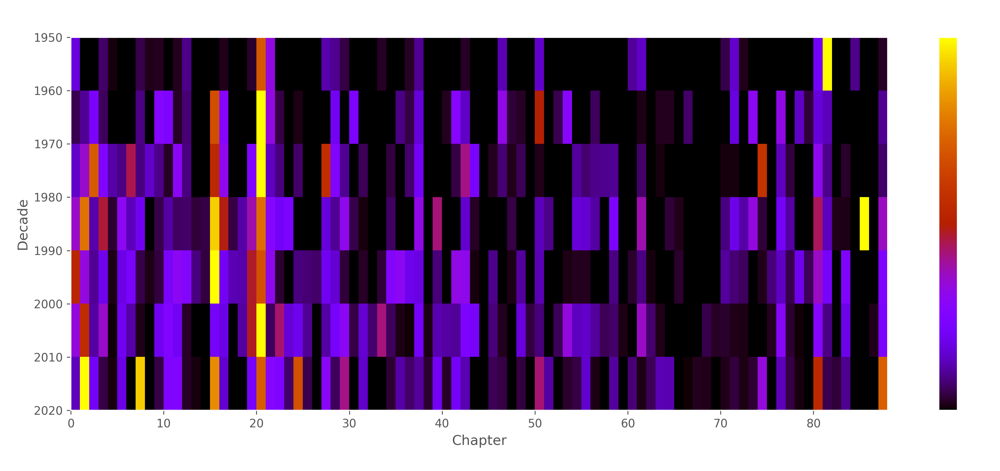
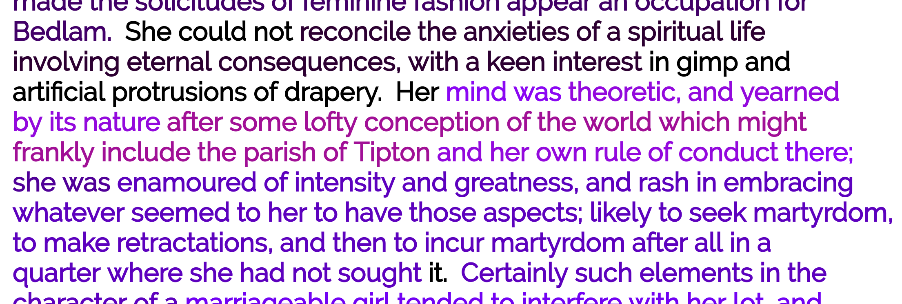

Text reuse detection technology and approximate text matching have made possible the large-scale computational identification of intertextuality. These technologies have often been used in plagiarism detection and in studies of journalistic text reuse. Fewer studies, however, have applied these methods to humanities research. We present a method for quantifying the critical reception history of a source text by analyzing the precise location, density and chronology of its citations.

Our work builds on a recent set of digital humanities projects that use text reuse detection in order to study the afterlife of texts through textual quotation (Bär, D. et al, 2012; Büchler, M., et al., 2014; Ganascia, J.-G., 2014; Smith, D.A. et al, 2013; 2014). The [Viral Texts](http://viraltexts.org/) project and [Digital Breadcrumbs of Brothers Grimm](http://www.etrap.eu/digital-breadcrumbs-of-brothers-grimm/) take algorithmic approaches to studying text reuse and circulation in their respective fields of research: nineteenth-century popular press and folklore. In both projects, the focus is on using text reuse detection to uncover hidden networks of reuse---the reprinting of short news items and the re-use of motifs or minimal narrative units in folklore---in corpora without standardized conventions of citation. Our project seeks to take this work a step further, by applying a similar method in a different area of cultural production where more standardized citation conventions already exist: academic citations. We draw on the work of Dennis Tenen---in using extracted citations to critically visualize the "knowledge domain" of *Comparative Literature* (Tenen, 2017)---and a recent project by JSTOR Labs that uses the text of [Shakespeare's plays](https://labs.jstor.org/shakespeare/) and the [U.S. Constitution](http://labs.jstor.org/constitution-site/) to visualize the scholarship surrounding passages in those sets of texts. Like these projects, we hope to leverage the explicit and institutionalized nature of academic citation in studying text-reuse patterns, using text reuse to ask questions of critical attention in canon formation. By focusing initially on a single text in order to ask about its critical reception history, we hope to provide new methods for studying not only text-reuse patterns, but the sociology of citation practices---studying changes in when, how, and what critics cite from a given text.

In applying these methods to literary scholarship, we've chosen to start on a relatively small scale. George Eliot's novel _Middlemarch_ is an ideal test case, due to its length, copyright status, stable editorial history and canonicity. Perhaps most appropriately for this study, _Middlemarch_ is known for its narrator’s wise generalizations---quotable fragments that have been featured in more than one Victorian volume of George Eliot’s sayings. We work with JSTOR Labs to assemble a corpus of all 6,500 articles in their collection that discuss _Middlemarch_. The figures below display preliminary results with a smaller 483-sample corpus.

At the largest scale, Figure 1 shows the frequency of citations across the whole of _Middlemarch_ as a heat map segmented by decade, with yellow signifying the highest citation and black, no citations. The novel is broken into its chapters along the horizontal axis, and each segment is colored according to the number of times its text has appeared in the critical literature. Apart from the most-quoted Chapter 20, the beginning and end of the novel show the most numbers of quotations. 

Viewed chronologically, we see that critical interest in certain sections---as expressed in numbers of quotations---appears to shift over time. In the 1950s, most of the critical citation was concentrated on the end of the novel, but this interest has shifted to the beginning by the present day. 

Figure 2 shows a finer grained analysis, no longer segmented by decade, displaying an excerpt from [our paragraph-level text browser for _Middlemarch_](http://xpmethod.plaintext.in/middlemarch-critical-histories/annotated.html). Here again, the color coding represents the density of quotations of each segments, ranging from unquoted black passages, to more frequently quoted purple and red passages. In this sample, the somewhat abstract contrast between "spiritual life" versus "gimp" and "drapery" remains unquoted, whereas the definitive and punchy “her mind was theoretic” has triggered numerous quotations. This annotated edition could provide scholars with a way to read the novel for passages that have been most discussed in secondary literature, and for passages that have been critically neglected.

The potential applications of this methodology are numerous and wide-ranging. Firstly, this methodology can be used in any discipline to investigate the discipline’s theoretical history. As with the 1980 study of Wundt's influence on the field of psychology (Brožek,  1980), our methodology could rapidly and easily produce similar investigations for the influence of Saussure in linguistics, Bourdieu in sociology, Mead in anthropology, Beauvoir in feminist theory, and so on. Moreover, this analysis would be much more fine-grained, registering not only the frequency of works cited but also specific sections, passages and even key phrases within them.

To return to literary studies, while our own initial project is focusing on academic literary criticism of the post-war period, the methodology could equally be applied to earlier aspects of literary reception. We are interested to examine whether patterns of citation change measurably since English literature is established as a discipline in the late nineteenth century. Going even further back, our methodology could equally be applied to quotations of literary works in non-academic formats, whether non-fiction (newspapers, journals, essays) or other literary works (citations of Shakespeare in Romantic poetry, say).

## References

**Bär, D., Zesch, T., Gurevych, I.,** (2012). "Text Reuse Detection Using a Composition of Text Similarity Measures." *Proceedings of COLING 2012* 1, 167–184.

**Brožek, J.** (1980). “The Echoes of Wundt’s Work in the United States, 1887–1977: A Quantitative Citation Analysis.” *Psychological Research*, vol. 42, no. 1–2, pp. 103–107.

**Büchler, M., Burns, P.R., Müller, M., Franzini, E., Franzini, G.,** (2014). "Towards a Historical Text Re-use Detection." In Biemann, C., Mehler, A. (Eds.), T*ext Mining, Theory and Applications of Natural Language Processing*. Springer International Publishing, pp. 221–238. 

**Ganascia, J.-G., Glaudes, P., Del Lungo, A.,** (2014). "Automatic detection of reuses and citations in literary texts." *Lit Linguist Computing* 29, 412–421. 

**Smith, D.A., Cordell, R., Dillon, E.M.,** (2013). Infectious texts: Modeling text reuse in nineteenth-century newspapers, in: *2013 IEEE International Conference on Big Data. Presented at the 2013* IEEE International Conference on Big Data, pp. 86–94. 

**Smith, D.A., Cordell, R., Dillon, E.M., Stramp, N., Wilkerson, J.,** (2014). ""Detecting and Modeling Local Text Reuse." In *Proceedings of the 14th ACM/IEEE-CS Joint Conference on Digital Libraries*, JCDL ’14. IEEE Press, Piscataway, NJ, USA, pp. 183–192.

**Tenen, D.** (2017). "Digital Displacement." In *Futures of Comparative Literature*, Ursula K. Heise, Dudley Andrew, Alexander Beecroft, Jessica Berman, David Damrosch, Guillermina De Ferrari, César Domínguez, Barbara Harlow, and Eric Hayot  (eds.) London: Routledge.
